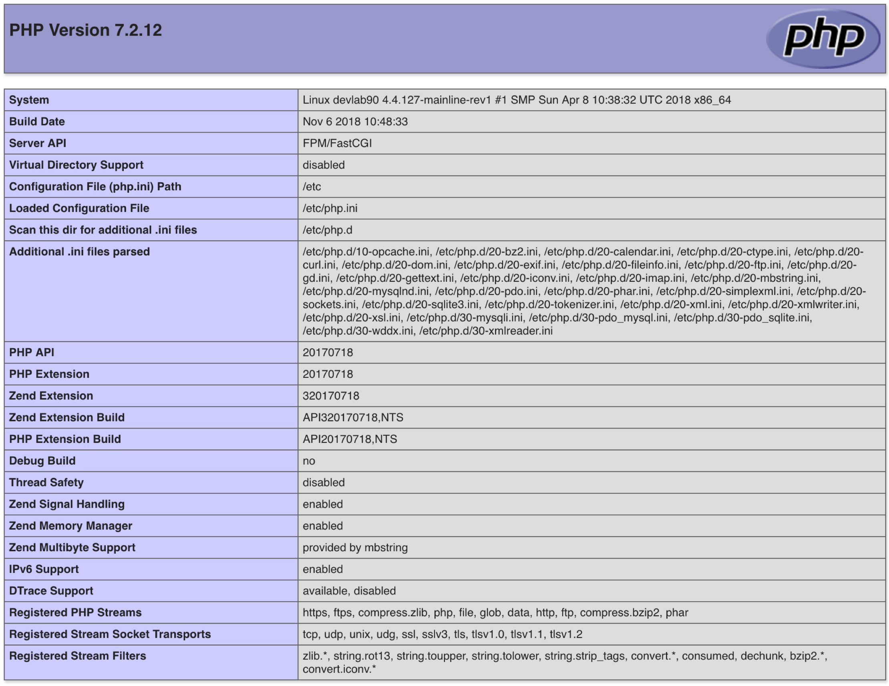

# Lab Automation LAMP Wordpress

<!-- TOC depthFrom:2 depthTo:6 withLinks:1 updateOnSave:1 orderedList:0 -->

- [1. Premiers essai](#1-premiers-essai)
	- [1.1. Méthodologie et consigne](#11-mthodologie-et-consigne)
	- [1.2. Apache](#12-apache)
		- [Installation et activation](#installation-et-activation)
		- [Tests](#tests)
		- [GET HTTP](#get-http)
		- [HEAD HTTP](#head-http)
		- [Configuration courante](#configuration-courante)
		- [Hôtes virtuels](#htes-virtuels)
	- [1.4. Base de données](#14-base-de-donnes)
		- [Tests](#tests)
		- [mysql_secure_installation](#mysqlsecureinstallation)
	- [1.5. Installation de PHP](#15-installation-de-php)
	- [1.6. Problématiques rencontrées](#16-problmatiques-rencontres)
		- [PHP-FPM](#php-fpm)
		- [Pare-feu](#pare-feu)
	- [1.7. Téléchargement de Wordpress](#17-tlchargement-de-wordpress)
	- [1.8. Création de la base de données de Wordpress](#18-cration-de-la-base-de-donnes-de-wordpress)
	- [1.9. Configurer Wordpress](#19-configurer-wordpress)
	- [1.10. Installer Worpdress](#110-installer-worpdress)
	- [1.11. Nettoyer ses opérations](#111-nettoyer-ses-oprations)
- [2. Améliorations et automatisations](#2-amliorations-et-automatisations)
	- [2.1. Installation, configuration et lancement du stack LAMP](#21-installation-configuration-et-lancement-du-stack-lamp)
	- [2.2. Création de la base de donnée](#22-cration-de-la-base-de-donne)
	- [2.3. Tests des services](#23-tests-des-services)
	- [2.4. Installation de Wordpress](#24-installation-de-wordpress)
- [3. Script fonctionnel](#3-script-fonctionnel)
	- [3.1. Mise en variables](#31-mise-en-variables)
	- [3.2. Installation des logiciels](#32-installation-des-logiciels)
	- [3.3. démarrage des services](#33-dmarrage-des-services)
	- [3.4. Ouverture du par-feu](#34-ouverture-du-par-feu)
	- [3.5. Sécuriser Mariabd et le configurer pour Wordpress](#35-scuriser-mariabd-et-le-configurer-pour-wordpress)
	- [3.6. Enregistrement des mots de passe](#36-enregistrement-des-mots-de-passe)
	- [3.7. Tests du stack](#37-tests-du-stack)
- [4. WP-CLI](#4-wp-cli)
	- [4.1 Installation de wp-cli](#41-installation-de-wp-cli)
	- [4.2. Vérifier le fonctionnement de wp-cli](#42-vrifier-le-fonctionnement-de-wp-cli)
	- [4.3. Télécharger Worpdress](#43-tlcharger-worpdress)
	- [4.4. Création du fichier de configuration](#44-cration-du-fichier-de-configuration)
	- [4.4. Créer la base de données Wordpress](#44-crer-la-base-de-donnes-wordpress)
	- [4.6. Installation de Wordpress](#46-installation-de-wordpress)
	- [4.7. Mise-à-jour de tous les plugins dans leur dernière version](#47-mise-jour-de-tous-les-plugins-dans-leur-dernire-version)
	- [4.8. Affichage des informations](#48-affichage-des-informations)
	- [4.9. Résumé du déploiement de Wordpress](#49-rsum-du-dploiement-de-wordpress)
	- [4.10. Programme principal](#410-programme-principal)
	- [4.11. Améliorations et optimisations](#411-amliorations-et-optimisations)
- [5. Déploiement de la solution sur Centos 7 et Ubuntu](#5-dploiement-de-la-solution-sur-centos-7-et-ubuntu)
	- [5.1. Déploiement Centos7](#51-dploiement-centos7)
	- [5.2. Déploiement sur Ubuntu](#52-dploiement-sur-ubuntu)
	- [5.2. Allow-root WP-CLI](#52-allow-root-wp-cli)
	- [5.3. Appel aux fonctions selon la distribution](#53-appel-aux-fonctions-selon-la-distribution)
- [6. Support HTTPS Let's Encrypt](#6-support-https-lets-encrypt)
	- [6.1. Virtual Hosts](#61-virtual-hosts)
	- [6.2. Fichier vhost pour Centos / Fedora](#62-fichier-vhost-pour-centos-fedora)
	- [6.4. Fichier vhost pour Debian / Ubuntu](#64-fichier-vhost-pour-debian-ubuntu)
	- [6.5. Mise en commun de la configuration vhost](#65-mise-en-commun-de-la-configuration-vhost)
	- [6.6. Certbot Let's Encrypt](#66-certbot-lets-encrypt)
- [7. Déploiement Wordpress Haute Disponiblité](#7-dploiement-wordpress-haute-disponiblit)
- [8. Déploiement sur Docker](#8-dploiement-sur-docker)
- [9. Approvisionnement Ansible](#9-approvisionnement-ansible)
- [10. Application Stateful Wordpress sur un cluster Kubernetes](#10-application-stateful-wordpress-sur-un-cluster-kubernetes)
- [11. Script final](#11-script-final)

<!-- /TOC -->


Vous vous initiez à l'administration DevOps du [moteur de blogging Wordpress](https://fr.wikipedia.org/wiki/WordPress). Dans une première approche vous cherchez un base pour commencer votre déploiement. Vous choisissez un article dont le nom est évocateur : [How to Install LAMP Stack on Fedora 27](https://linoxide.com/linux-how-to/install-lamp-stack-fedora-27/). Car la machine qui est approvisionnée chez Scaleway est un DEV1-S avec une image Fedora 27.

Vous démarrez donc en [Fedora 27](https://linux.goffinet.org/01-02-distributions-linux-et-cycles-de-maintenance/#72-fedora) pour déployer un serveur Wordpress basé sur le [stack LAMP](https://fr.wikipedia.org/wiki/LAMP).

## 1. Premiers essai

À la lecture du tuto, la procédure se résume en deux étapes principales auxquelles correspondent les tâches suivantes.

1. Déploiement du stack LAMP
  1. Installation et test du serveur Web
  2. Installation et sécurisation du service de base données
  3. Installation et test de PHP
2. Déploiement de l'application Wordpress
  1. Téléchargement de Wordpress
  2. Création de la base de données de Wordpress
  3. Création du fichier de configuration de wordpress
  4. Installation manuelle de Wordpress

### 1.1. Méthodologie et consigne

Exécutez chaque commande opérationnelle. Copiez les actions qui s'exécutent avec succès dans un fichier destiné à devenir un script d'automatisation Bash.

Veuillez également exécuter les commandes de diagnostic, évaluer celles qui conviennent le mieux à des tests et les retenir dans votre fichier de travail.

### 1.2. Apache

#### Installation et activation

```bash
dnf install httpd
```

```bash
systemctl enable httpd.service
systemctl start httpd.service
```
#### Tests

Apache :

```bash
systemctl status httpd
```

```bash
journalctl -f -l -u httpd
```
```bash
tail /var/log/httpd/error_log
```

```bash
httpd -V
```

on peut demander à curl de rendre un résultat sur le serveur Web. En effet, le dossier par défaut des pages à servir est `/var/www/html`. En l'absence d'un fichier d'index par défaut, une page "noindex" est servie à partir de l'emplacement `/usr/share/httpd/`.

#### GET HTTP

```bash
curl -G http://127.0.0.1
<!DOCTYPE html PUBLIC "-//W3C//DTD XHTML 1.1//EN" "http://www.w3.org/TR/xhtml11/DTD/xhtml11.dtd">

<html xmlns="http://www.w3.org/1999/xhtml" xml:lang="en" lang="en">
	<head>
		<title>Test Page for the Apache HTTP Server on Fedora</title>
    ...
```

#### HEAD HTTP

```bash
echo "OK" > /var/www/html/test
```
```bash
curl -I http://127.0.0.1/
HTTP/1.1 200 OK
Date: Sun, 18 Nov 2018 12:07:14 GMT
Server: Apache/2.4.34 (Fedora)
Last-Modified: Sun, 18 Nov 2018 12:07:10 GMT
ETag: "3-57aef3d7c776a"
Accept-Ranges: bytes
Content-Length: 3
Content-Type: text/html; charset=UTF-8
```
```bash
curl -G http://127.0.0.1/test
OK
```

#### Configuration courante

On sera curieux d'examiner la configuration du serveur Web située dans l'emplacement `/etc/httpd`.

```bash
egrep -v '^$|^[[:blank:]]*#' /etc/httpd/conf/httpd.conf
ServerRoot "/etc/httpd"
Listen 80
Include conf.modules.d/*.conf
User apache
Group apache
ServerAdmin root@localhost
<Directory />
    AllowOverride none
    Require all denied
</Directory>
DocumentRoot "/var/www/html"
<Directory "/var/www">
    AllowOverride None
    Require all granted
</Directory>
<Directory "/var/www/html">
    Options Indexes FollowSymLinks
    AllowOverride None
    Require all granted
</Directory>
<IfModule dir_module>
    DirectoryIndex index.html
</IfModule>
<Files ".ht*">
    Require all denied
</Files>
ErrorLog "logs/error_log"
LogLevel warn
<IfModule log_config_module>
    LogFormat "%h %l %u %t \"%r\" %>s %b \"%{Referer}i\" \"%{User-Agent}i\"" combined
    LogFormat "%h %l %u %t \"%r\" %>s %b" common
    <IfModule logio_module>
      LogFormat "%h %l %u %t \"%r\" %>s %b \"%{Referer}i\" \"%{User-Agent}i\" %I %O" combinedio
    </IfModule>
    CustomLog "logs/access_log" combined
</IfModule>
<IfModule alias_module>
    ScriptAlias /cgi-bin/ "/var/www/cgi-bin/"
</IfModule>
<Directory "/var/www/cgi-bin">
    AllowOverride None
    Options None
    Require all granted
</Directory>
<IfModule mime_module>
    TypesConfig /etc/mime.types
    AddType application/x-compress .Z
    AddType application/x-gzip .gz .tgz
    AddType text/html .shtml
    AddOutputFilter INCLUDES .shtml
</IfModule>
AddDefaultCharset UTF-8
<IfModule mime_magic_module>
    MIMEMagicFile conf/magic
</IfModule>
EnableSendfile on
IncludeOptional conf.d/*.conf
```

#### Hôtes virtuels

On s'intéressera au concept [d'hôte virtuel](https://linux.goffinet.org/31_services_apache_http_server/#7-serveurs-virtuels-par-nom).

### 1.4. Base de données

#### Tests

Mariadb :

```bash
dnf install mariadb-server
```
```bash
systemctl start mariadb.service
systemctl enable mariadb.service
```

```bash
systemctl status mariadb.service
mysql -V
```

```bash
ss -tlp | egrep 'http|mysql'
LISTEN   0         80                        *:mysql                  *:*        users:(("mysqld",pid=4972,fd=37))
LISTEN   0         128                       *:http                   *:*        users:(("httpd",pid=6206,fd=4),("httpd",pid=5457,fd=4),("httpd",pid=5456,fd=4),("httpd",pid=5455,fd=4),("httpd",pid=5201,fd=4))
```

#### mysql_secure_installation

Avant de l'utiliser, il est de bonne pratique de sécuriser un service de base de données MYSQL.

```bash
mysql_secure_installation
```

```bash
NOTE: RUNNING ALL PARTS OF THIS SCRIPT IS RECOMMENDED FOR ALL MariaDB
      SERVERS IN PRODUCTION USE!  PLEASE READ EACH STEP CAREFULLY!

In order to log into MariaDB to secure it, we'll need the current
password for the root user.  If you've just installed MariaDB, and
you haven't set the root password yet, the password will be blank,
so you should just press enter here.

Enter current password for root (enter for none):
OK, successfully used password, moving on...

Setting the root password ensures that nobody can log into the MariaDB
root user without the proper authorisation.

Set root password? [Y/n] Y
New password:
Re-enter new password:
Password updated successfully!
Reloading privilege tables..
 ... Success!


By default, a MariaDB installation has an anonymous user, allowing anyone
to log into MariaDB without having to have a user account created for
them.  This is intended only for testing, and to make the installation
go a bit smoother.  You should remove them before moving into a
production environment.

Remove anonymous users? [Y/n] y
 ... Success!

Normally, root should only be allowed to connect from 'localhost'.  This
ensures that someone cannot guess at the root password from the network.

Disallow root login remotely? [Y/n] y
 ... Success!

By default, MariaDB comes with a database named 'test' that anyone can
access.  This is also intended only for testing, and should be removed
before moving into a production environment.

Remove test database and access to it? [Y/n] y
 - Dropping test database...
 ... Success!
 - Removing privileges on test database...
 ... Success!

Reloading the privilege tables will ensure that all changes made so far
will take effect immediately.

Reload privilege tables now? [Y/n] y
 ... Success!

Cleaning up...

All done!  If you've completed all of the above steps, your MariaDB
installation should now be secure.

Thanks for using MariaDB!
```

### 1.5. Installation de PHP

```bash
dnf install php php-common
```
```bash
dnf install php php-common php-mysqlnd php-gd php-imap php-xml php-cli php-opcache php-mbstring
```

```bash
systemctl restart httpd
cd /var/www/html
echo "<?php phpinfo(); ?>" >> info.php
curl http://127.0.0.1/info.php
```

Notons que c'est la **version 7.2 de PHP** qui est en fonction.

Examen de la page `info.php`.



### 1.6. Problématiques rencontrées

[Dépot Remi](https://blog.remirepo.net/pages/Presentation) : https://blog.remirepo.net/pages/Config

#### PHP-FPM

PHP-FPM : voir [Utiliser Apache avec PHP-FPM](https://villalard.net/utiliser-apache-avec-php-fpm)

```bash
curl http://127.0.0.1/info.php
<!DOCTYPE HTML PUBLIC "-//IETF//DTD HTML 2.0//EN">
<html><head>
<title>503 Service Unavailable</title>
</head><body>
<h1>Service Unavailable</h1>
<p>The server is temporarily unable to service your
request due to maintenance downtime or capacity
problems. Please try again later.</p>
</body></html>
```

Au lieu d'obtenir la "belle" page info.php, on obtient un message d'erreur **503 Service Unavailable** qui renseigne une erreur du côté du serveur ([Codes de retour HTTP](https://linux.goffinet.org/30_services_web/#74-codes-de-retour))

```bash
tail /var/log/httpd/error_log -n2
[Sun Nov 18 12:25:52.916813 2018] [proxy:error] [pid 5207:tid 140606827362048] (2)No such file or directory: AH02454: FCGI: attempt to connect to Unix domain socket /run/php-fpm/www.sock (*) failed
[Sun Nov 18 12:25:52.916891 2018] [proxy_fcgi:error] [pid 5207:tid 140606827362048] [client 127.0.0.1:36686] AH01079: failed to make connection to backend: httpd-UDS
```

Les logs httpd nous indiquent une erreur php-fpm.

```bash
ls /run/php-fpm/www.sock
ls: cannot access '/run/php-fpm/www.sock': No such file or directory
[root@devlab90 html]# ls /run/php-fpm
ls: cannot access '/run/php-fpm': No such file or directory
```

Ce fichier `/run/php-fpm/www.sock` n'existe pas.

```bash
tail -n3 /var/log/php-fpm/error.log
[18-Nov-2018 12:25:50] ERROR: FPM initialization failed
[18-Nov-2018 12:28:15] ERROR: [pool www] failed to read the ACL of the socket '/run/php-fpm/www.sock': Operation not supported (95)
[18-Nov-2018 12:28:15] ERROR: FPM initialization failed
```

```bash
sed -i 's/listen.acl_users/;listen.acl_users/g' /etc/php-fpm.d/www.conf
```

En commentant la ligne qui contient `listen.acl_users`, le service redémarre.

```bash
systemctl start php-fpm
systemctl status php-fpm
```

```bash
curl http://127.0.0.1/info.php
<!DOCTYPE HTML PUBLIC "-//IETF//DTD HTML 2.0//EN">
<html><head>
<title>503 Service Unavailable</title>
</head><body>
<h1>Service Unavailable</h1>
<p>The server is temporarily unable to service your
request due to maintenance downtime or capacity
problems. Please try again later.</p>
</body></html>
```

Mais l'erreur serveur ne disparaît qu'en fixant les droits de l'utilisateur apache sur le fichier du pool PHP-FPM `/run/php-fpm/www.sock`.

```bash
chown apache:apache /run/php-fpm/www.sock
```

```bash
curl http://127.0.0.1/info.php
```

#### Pare-feu

Comment joindre le serveur de l'extérieur ?

```bash
ip=$(curl -s -G http://ipinfo.io/ip)
url="http://www.${ip}.xip.io/"
```

```bash
echo $url
```

Le stack est-il accessible de l'extérieur ? En Fedora dans lequel le pare-feu est activé par défaut, probablement.

```bash
firewall-cmd --list-services
```

Il est nécessaire d'ouvrir le pare-feu, par exemple en ajoutant le service "http" au profil de filtrage par défaut "public".

```bash
firewall-cmd --zone=public --permanent --add-service=http
firewall-cmd --reload
```
Comment pourrait-on tester le site sans ouvrir le pare-feu, uniquement avec une connexion SSH ?

En transférant le port local TCP80 sur un port de l'ordinateur qui se connecte ici par exemple TCP8888.

```bash
ssh -L 8888:127.0.0.1:80 root@votres_serveur
```

### 1.7. Téléchargement de Wordpress

Cette étape demande des compétences d'administration "traditionnelle".

```bash
dnf install wget
wget http://wordpress.org/latest.tar.gz
tar xvfz latest.tar.gz -C /var/www/html/
```

### 1.8. Création de la base de données de Wordpress

La procédure consiste à se connecter à la base de données en tant qu'utilisateur "root" de la base de données et à encoder les commandes suivantes qui créent un utilisateur avec un mot de passe à modifier ("testadmin208"), qui créent une base de données et qui lient l'utilisateur à la base de donnée.

```bash
mysql -u root -p
```

Dans le shell mysql, voici les commandes à encoder :

```mysql
CREATE USER wpuser@localhost IDENTIFIED BY "testadmin208";
CREATE DATABASE wp_database;
GRANT ALL ON wp_database.* TO wpuser@localhost;
FLUSH PRIVILEGES;
quit
```

### 1.9. Configurer Wordpress

Il s'agit ici d'indiquer les paramètres de la base de données créée dans l'étape précédente dans un fichier `wp-config.php` en se servant du modèle `wp-config-sample.php`.

```bash
cd /var/www/html/wordpress/
cp wp-config-sample.php wp-config.php
```

Ensuite, modifier les paramètres à l'aide de `vi` :

```
define('DB_NAME', 'wp_database');
define('DB_USER', 'wpuser');
define('DB_PASSWORD', 'testadmin208');
define('DB_HOST', 'localhost');
```

### 1.10. Installer Worpdress

La suite de l'installation se déroule dans l'interface Web. Entretemps, le site reste vulnérable.

```bash
curl http://127.0.0.1/wordpress/
```

### 1.11. Nettoyer ses opérations

Le script `clean-lamp.sh` se propose de nettoyer grossièrement ces opérations.

```bash
#! /bin/bash
# clean-lamp.sh
systemctl stop httpd mariadb php-fpm
systemctl disable httpd mariadb php-fpm
dnf -y remove mariadb mariadb-server httpd php-fpm
rm -rf /var/lib/mysql
rm -r /etc/my.cnf
rm -r ~/.my.cnf
rm -rf /var/www/html/*
firewall-cmd --zone=public --permanent --remove-service=http
firewall-cmd --reload
```

## 2. Améliorations et automatisations

Dans cet exercice, on reprendra les opérations dans une perspective d'automation qui regroupe les tâches dans des étapes distinctes. Un seul mot de passe est choisi "Yj7tXc1Ml". La perspective reste séquentielle.

On tentera de rassembler les opérations logiques en étapes : installation, configuration, lancement, test, ... La procédure d'installation de Wordpress peut elle-même être divisée en quelques étapes.

* Installation, configuration et lancement du stack LAMP
* Création de la base de donnée
* Test des services
* Installation de Wordpress

### 2.1. Installation, configuration et lancement du stack LAMP

En regroupes les tâches d'installation, de configuration et de lancement des services LAMP, la configuration du pare-feu.

```bash
# Choose a password for root and wpuser database : "Yj7tXc1Ml"
# LAMP Stack installation and dependencies
dnf -y install httpd mariadb-server php php-mysqlnd php-json wget
# Configure php-fpm
sed -i 's/listen.acl_users/;listen.acl_users/g' /etc/php-fpm.d/www.conf
# Enable and start services
systemctl enable httpd mariadb php-fpm
systemctl start httpd mariadb php-fpm
chown apache:apache /run/php-fpm/www.sock
# Open the HTTP port TCP 80
firewall-cmd --zone=public --permanent --add-service=http
firewall-cmd --reload
```

### 2.2. Création de la base de donnée

La base de données Wordpress est créée et configurée après avoir sécurisé le service.

```bash
# See https://stackoverflow.com/questions/24270733/automate-mysql-secure-installation-with-echo-command-via-a-shell-script
# See https://gist.github.com/Mins/4602864
# mysql_secure_installation as model
# Make sure that NOBODY can access the server without a password
mysql -e "UPDATE mysql.user SET Password = PASSWORD('Yj7tXc1Ml') WHERE User = 'root'"
# Kill the anonymous users
mysql -e "DROP USER ''@'localhost'"
# Because our hostname varies we'll use some Bash magic here.
mysql -e "DROP USER ''@'$(hostname)'"
# Kill off the demo database
mysql -e "DROP DATABASE test"
# Create wpuser
mysql -e "CREATE USER wpuser@localhost IDENTIFIED BY 'Yj7tXc1Ml';"
# Create wp_database
mysql -e "CREATE DATABASE wp_database;"
# Fix wpuser rights on wp_database
mysql -e "GRANT ALL ON wp_database.* TO wpuser@localhost;"
# Make our changes take effect
mysql -e "FLUSH PRIVILEGES"
echo 'root password : Yj7tXc1Ml' > /root/.wpsecrets
echo 'wpuser password : Yj7tXc1Ml' >> /root/.wpsecrets
chmod 600 /root/.wpsecrets
```

Remarquez que le mot de passe est enregistré dans le fichier caché `/root/.wpsecrets`

### 2.3. Tests des services

```bash
# Test Apache
if [ $(curl -s -I 127.0.0.1 | grep -q 'Server: Apache/2.4.34 (Fedora)' ; echo $?) == '0' ] ; then
echo "Apache is working" ; else
echo "Apache is NOT working" ; fi
```

```bash
# Test PHP
echo "<?php phpinfo(); ?>" > /var/www/html/info.php
if [ $(curl -s -G http://127.0.0.1/info.php | grep -q 'phpinfo' ; echo $?) == '0' ] ; then
echo "PHP is working" ; else
echo "PHP is NOT working" ; fi
#rm -f /var/www/html/info.php
```

### 2.4. Installation de Wordpress

```bash
# Download Wordpress lastest version
wget http://wordpress.org/latest.tar.gz
tar xvfz latest.tar.gz -C /var/www/html/
cp /var/www/html/wordpress/wp-config-sample.php /var/www/html/wordpress/wp-config.php
sed -i 's/database_name_here/wp_database/g' /var/www/html/wordpress/wp-config.php
sed -i 's/username_here/wpuser/g' /var/www/html/wordpress/wp-config.php
sed -i 's/password_here/Yj7tXc1Ml/g' /var/www/html/wordpress/wp-config.php
# Configure your application
echo "Go to http://$(curl -s https://ipinfo.io/ip).xip.io/wordpress/ to configure your application"
```

## 3. Script fonctionnel

L'exercice précédent consistait à reprendre les lignes de commandes manuelles et à les automatiser.

Toutefois, on peut suggérer quelques optimisations qui rendraient la procédure plus évolutive et plus robuste.

* Les étapes logiques pourraient être présentées sous forme de fonctions.
* Toute une série de paramètres pourraient subir une mise en variable.
* Enfin la seconde étape d'installation de Wordpress semble peu robuste. On proposera ici d'utiliser wp-cli.

Voici un troisième exercice qui illustre ces optimisations.

### 3.1. Mise en variables

L'adresse IP du site, son [FQDN](https://fr.wikipedia.org/wiki/Fully_qualified_domain_name), son titre, les utilisateurs "admin" (utilisateur de gestion) et "dbuser" (utilisateur de la base de données), l'emplacement de l'application, les mots de passe (générés de manière aléatoire) sont susceptibles d'être mis en paramètres.

```bash
ip_adress=$(curl -s https://ipinfo.io/ip)
site_title="Demo Wordpress"
site_url="http://www.${ip_adress}.xip.io"
application_path="/var/www/html"
admin_email="test@test.com"
admin_user="admin"
admin_password=$(pwmake 128 | head -c12)
dbuser="wpuser"
dbroot_password=$(pwmake 128 | head -c12)
dbuser_password=$(pwmake 128 | head -c12)

```

### 3.2. Installation des logiciels

Installation des logiciels et adaptation du fichier `/etc/php-fpm.d/www.conf`.

```bash
software_installation() {
# LAMP Stack installation and dependencies
dnf -y install httpd mariadb-server php php-mysqlnd php-json curl python
# Work around php-fpm config due the lack of apache config
sed -i 's/listen.acl_users/;listen.acl_users/g' /etc/php-fpm.d/www.conf
}
```

### 3.3. démarrage des services

On donnera les droits aux utilisateur et groupe `apache` sur le fichier `/run/php-fpm/www.sock`.

```bash
enable_start_services() {
# Enable and start services
systemctl enable httpd mariadb php-fpm
systemctl start httpd mariadb php-fpm
chown apache:apache /run/php-fpm/www.sock
}
```

### 3.4. Ouverture du par-feu

```bash
open_firewall() {
# Open the HTTP port TCP 80
firewall-cmd --zone=public --permanent --add-service=http
firewall-cmd --reload
}
```


### 3.5. Sécuriser Mariabd et le configurer pour Wordpress

Il s'agit de profiter de l'absence de mot de passe sur le compte root pour créer la base et l'utilisateur Wordpress.

```bash
wordpress_database_creation() {
# Create dbuser
mysql -e "CREATE USER ${dbuser}@localhost IDENTIFIED BY '${dbuser_password}';"
# Create wp_database
mysql -e "CREATE DATABASE wp_database;"
# Fix dbuser rights on wp_database
mysql -e "GRANT ALL ON wp_database.* TO ${dbuser}@localhost;"
# Make our changes take effect
mysql -e "FLUSH PRIVILEGES"
}
```

```bash
mysql_secure() {
# mysql_secure_installation as model
# Make sure that NOBODY can access the server without a password
mysql -e "UPDATE mysql.user SET Password = PASSWORD('${dbroot_password}') WHERE User = 'root'"
# Kill the anonymous users
mysql -e "DROP USER ''@'localhost'"
# Because our hostname varies we'll use some Bash magic here.
mysql -e "DROP USER ''@'$(hostname)'"
# Kill off the demo database
mysql -e "DROP DATABASE test"
# Make our changes take effect
mysql -e "FLUSH PRIVILEGES"
}
```

### 3.6. Enregistrement des mots de passe

```bash
store_passwords() {
echo "dbroot_password=${dbroot_password}" > /root/.wpsecrets
echo "dbuser_password=${dbuser_password}" >> /root/.wpsecrets
echo "admin_password=${admin_password}" >> /root/.wpsecrets
chmod 600 /root/.wpsecrets
}
```

### 3.7. Tests du stack

```bash
test_stack() {
# Test Apache
if [ $(curl -s -I 127.0.0.1 | grep -q 'Server: Apache/2.4.34 (Fedora)' ; echo $?) == '0' ] ; then
echo "Apache is working" ; else
echo "Apache is NOT working" ; break ; fi
apachectl -V

# Test PHP
echo "<?php phpinfo(); ?>" > ${application_path}/info.php
if [ $(curl -s -G http://127.0.0.1/info.php | grep -q 'phpinfo' ; echo $?) == '0' ] ; then
echo "PHP is working" ; else
echo "PHP is NOT working" ; break ; fi
#rm -f ${application_path}/info.php
}
```

## 4. WP-CLI

WP-CLI est un ensemble d’outils en ligne de commande pour gérer les installations WordPress. Vous pouvez mettre à jour les extensions, configurer des installations multi-site et beaucoup plus sans avoir recours à un navigateur web.

Voir [WP-CLI: Interface en ligne de commande pour WordPress](https://wp-cli.org/fr/).

Toutes les opérations sur Wordpress en ligne de commande :

* Téléchargement / mise à jour
* Installation, configuration, création de base de données
* Installation de thèmes, de plugins, création et gestion des utilisateurs
* ...

[Guide de démarrage wp-cli](https://make.wordpress.org/cli/handbook/quick-start/)

[Installation wp-cli](https://make.wordpress.org/cli/handbook/installing/)

### 4.1 Installation de wp-cli

```bash
curl -O https://raw.githubusercontent.com/wp-cli/builds/gh-pages/phar/wp-cli.phar
chmod +x wp-cli.phar ; mv wp-cli.phar /usr/local/bin/wp
```

### 4.2. Vérifier le fonctionnement de wp-cli

```bash
# Check if wp-cli is working
if [ $(wp --info > /dev/null ; echo $?) == '0' ] ; then
echo "wp-cli is working" ; else
echo "wp-cli is NOT working" ; fi
```

### 4.3. Télécharger Worpdress

[wp core download](https://developer.wordpress.org/cli/commands/core/download/)

```bash
# Download Wordpress
wp core download --path=${application_path} --locale=fr_FR
```

### 4.4. Création du fichier de configuration

[wp config create](https://developer.wordpress.org/cli/commands/config/create/)

```bash
# Create wp-config.php
wp config create --dbname=wp_database \
--dbuser=${dbuser} \
--dbpass=${dbuser_password} \
--path=${application_path}
```

### 4.4. Créer la base de données Wordpress

La base de données a été créée dans une étape précédente. Ici, pour documentation avec wp-cli.

[wp db create](https://developer.wordpress.org/cli/commands/db/create/)

### 4.6. Installation de Wordpress

[wp core install](https://developer.wordpress.org/cli/commands/core/install/)

```bash
# Installation Wordpress
wp core install --url=${site_url} \
--title="${site_title}" \
--admin_user=${admin_user} \
--admin_password=${admin_password} \
--admin_email=${admin_email} \
--path=${application_path}
```

### 4.7. Mise-à-jour de tous les plugins dans leur dernière version

```bash
# Update plugins to their latest version
wp plugin update --all --path=${application_path}
```

### 4.8. Affichage des informations

```bash
echo "Go to ${site_url} to access to your application"
```

### 4.9. Résumé du déploiement de Wordpress

```bash
wpcli_installation() {
# Installation de wp-cli
curl -O https://raw.githubusercontent.com/wp-cli/builds/gh-pages/phar/wp-cli.phar
chmod +x wp-cli.phar ; mv wp-cli.phar /usr/local/bin/wp

# Check if wp-cli is working
if [ $(wp --info > /dev/null ; echo $?) == '0' ] ; then
echo "wp-cli is working" ; else
echo "wp-cli is NOT working" ; fi
}

wordpress_installation() {
# Download Wordpress
wp core download --path=${application_path} --locale=fr_FR

# Create wp-config.php
wp config create --dbname=wp_database \
--dbuser=${dbuser} \
--dbpass=${dbuser_password} \
--path=${application_path}

# Installation
wp core install --url=${site_url} \
--title="${site_title}" \
--admin_user=${admin_user} \
--admin_password=${admin_password} \
--admin_email=${admin_email} \
--path=${application_path}

# Update plugins to their latest version
wp plugin update --all --path=${application_path}
}

print_end_message() {
# Acces to your application
echo "Go to ${site_url} to access to your application"
}
```

### 4.10. Programme principal

```bash
software_installation
enable_start_services
open_firewall
store_passwords
test_stack
wordpress_database_creation
mysql_secure
wpcli_installation
wordpress_installation
print_end_message

```

### 4.11. Améliorations et optimisations

* Améliorer la gestion des erreurs
* Configuration en Vhosts
* Dépendance sendmail
* HTTPS / Let's Encrypt
* Renforcement sécuritaire de Wordpress
* SELINUX

## 5. Déploiement de la solution sur Centos 7 et Ubuntu

[How to install Apache, PHP 7.2 and MySQL on CentOS 7.4 (LAMP)](https://www.howtoforge.com/tutorial/centos-lamp-server-apache-mysql-php/) et [How To Install Linux, Apache, MySQL, PHP (LAMP) stack on Ubuntu 16.04](https://www.digitalocean.com/community/tutorials/how-to-install-linux-apache-mysql-php-lamp-stack-on-ubuntu-16-04).

Sur base de cette documentation sommaire, il est demandé d'adapter le script à la distribution Centos7 et Ubuntu.

```
[ $(grep -q 'Fedora release 27' /etc/fedora-release; echo $?) == 0 ]  && echo "do someting on fedora"
[ -f /etc/centos-release ] && echo "do someting on centos7"
[ -f /etc/lsb-release ] && echo "do someting on ubuntu"
```

### 5.1. Déploiement Centos7

A peu de choses près, il s'agit s'utiliser la commande `yum` plutôt que `dnf`, sauf que `php-fpm` n'est pas installé par défaut.

```bash
centos_software_installation() {
curl -L https://rpms.remirepo.net/enterprise/remi-release-7.rpm -o remi-release-7.rpm
rpm -Uvh remi-release-7.rpm
yum-config-manager --enable remi-php72
yum -y install httpd mariadb-server php php-common php-mysqlnd php-gd php-imap php-xml php-cli php-opcache php-mbstring php-json firewalld
}

centos_enable_start_services() {
systemctl enable httpd mariadb firewalld
systemctl start httpd mariadb firewalld
}
```

[How to Install FastCGI PHP-FPM on CentOS 7](https://www.webhostinghero.com/blog/install-fastcgi-php-fpm-on-centos-7/)

### 5.2. Déploiement sur Ubuntu

```bash
sudo apt update
sudo -y apt install apache2 php libapache2-mod-php mariadb-server php-mysql php-curl php-gd php-intl php-json php-mbstring php-xml php-zip
sudo systemctl enable apache2
sudo systemctl enable mysql
sudo systemctl start apache2
sudo systemctl start mysql
```

Voici ce que cela donne dans le script.

```bash
ubuntu_software_installation() {
ln -fs /usr/share/zoneinfo/Europe/Paris /etc/localtime
apt-get update
apt-get upgrade --yes --force-yes -o Dpkg::Options::="--force-confdef" -o Dpkg::Options::="--force-confold"
apt -y install apache2 php libapache2-mod-php mariadb-server php-mysql php-curl php-gd php-intl php-json php-mbstring php-xml php-zip firewalld
}

ubuntu_reload_services() {
#systemctl enable apache2 mysql firewalld
systemctl reload apache2 mysql firewalld
rm -rf /var/www/html/index.html
}
```

Les options `--yes --force-yes -o Dpkg::Options::="--force-confdef" -o Dpkg::Options::="--force-confold"` de la commande `apt-get `

Par défaut sous Ubuntu, les services installés sont activés et démarrent. Toutefois, il est nécessaire de redémarrer le service Apache.

Notons aussi l'effacement de la page `index.html` associée au "virtual host" par défaut. En effet, dans cette configuration, en dehors de l'indiscrétion créée, elle entrera en concurrence avec la page `index.php` de Wordpress.

Enfin, sous Ubuntu Bionic (18.04 LTS), configuration du paquet `tzdata` n'est pas nécessairement silencieuse de telle sorte que la zone horaire soit configurée d'avance (`ln -fs /usr/share/zoneinfo/Europe/Paris /etc/localtime`).

### 5.2. Allow-root WP-CLI

Aussi, on remarquera que `wp-cli` n'autorise pas à priori une exécution en tant que root, ce qui nous oblige à ajouter la directive `--allow-root` sur les commandes concernées.

```bash
wordpress_installation() {
# Download Wordpress
wp core download --path=${application_path} --locale=fr_FR --allow-root

# Create wp-config.php
wp config create --dbname=wp_database \
--dbuser=${dbuser} \
--dbpass=${dbuser_password} \
--path=${application_path} \
--allow-root

# Installation
wp core install --url=${site_url} \
--title="${site_title}" \
--admin_user=${admin_user} \
--admin_password=${admin_password} \
--admin_email=${admin_email} \
--path=${application_path} \
--allow-root

# Update plugins to their latest version
wp plugin update --all --path=${application_path} --allow-root
}

```

### 5.3. Appel aux fonctions selon la distribution

Quel critère utiliser pour conditionner l'exécution des fonctions `fedora_*`, `centos_*` ou `ubuntu_*` ?

Chaque distribution dispose d'au moins un fichier qui identifie son origine :

```bash
if [ $(grep -q 'Fedora release 27' /etc/fedora-release; echo $?) == 0 ] ; then
fedora_software_installation
fedora_enable_start_services
elif [ -f /etc/centos-release ] ; then
centos_software_installation
centos_enable_start_services
elif [ -f /etc/lsb-release ] ; then
ubuntu_software_installation
ubuntu_enable_start_services
fi
open_firewall
wordpress_database_creation
mysql_secure
store_passwords
test_stack
wpcli_installation
wordpress_installation
print_end_message
```

La distribution Fedora évolue tous les six mois de telle sorte qu'il vaille mieux préciser sa version.

## 6. Support HTTPS Let's Encrypt

* Configuration Apache
* Let's Encrypt Cert-Bot
* Cron

### 6.1. Virtual Hosts

[Hôte virtuel](https://linux.goffinet.org/31_services_apache_http_server/#7-serveurs-virtuels-par-nom).

Il serait de bonne pratique de configurer un "virtual host" supplémentaire (et de désactiver celui qui est installé par défaut).

### 6.2. Fichier vhost pour Centos / Fedora

Voici la procédure proposée pour Centos / Fedora.

```bash
fedora_vhost_creation() {
port="80"
error_log="/var/log/httpd/${site_name}-error_log"
access_log="/var/log/httpd/${site_name}-access_log common"
#Résolution de nom locale
echo "127.0.0.1 ${site_name}" >> /etc/hosts
#Création du dossier et des pages Web
mkdir -p ${application_path}/${site_name}
#Restauration de la policy Selinux sur le dossier créé
restorecon -Rv ${application_path}/${site_name}
#Création du dossier et des fichiers pour les logs
mkdir -p /var/log/httpd
touch /var/log/httpd/${site_name}-error_log
touch /var/log/httpd/${site_name}-access_log common
#Configuration du vhost
cat << EOF > /etc/httpd/conf.d/${site_name}.conf
<VirtualHost *:${port}>
ServerAdmin webmaster@${site_name}
DocumentRoot ${application_path}
ServerName ${site_name}
ErrorLog ${error_log}
CustomLog ${access_log}
</VirtualHost>
EOF
}
```

```bash
httpd -D DUMP_VHOSTS
```

### 6.4. Fichier vhost pour Debian / Ubuntu

Ici, juste pour mémoire sur Ubuntu.

`/etc/apache2/sites-available/example.com.conf`

```apache
<VirtualHost *:80>
	ServerName example.com
	ServerAlias www.example.com
	DocumentRoot "/var/www/example"
	<Directory "/var/www/example">
		Options FollowSymLinks
		AllowOverride all
		Require all granted
	</Directory>
	ErrorLog /var/log/apache2/error.example.com.log
	CustomLog /var/log/apache2/access.example.com.log combined
</VirtualHost>
```

```bash
sudo a2ensite example.com.conf
sudo a2dissite 000-default
sudo systemctl reload apache2
```

### 6.5. Mise en commun de la configuration vhost

```bash
vhost_creation() {
port="80"
error_log="${log_path}/${site_name}-error_log"
access_log="${log_path}/${site_name}-access_log common"
#Résolution de nom locale
echo "127.0.0.1 ${site_name}" >> /etc/hosts
#Création du dossier et des pages Web
mkdir -p ${application_path}/${site_name}
#Création du dossier et des fichiers pour les logs
mkdir -p ${log_path}
touch ${error_log}
touch ${access_log}
#Configuration du vhost
cat << EOF > ${vhost_path}/${site_name}.conf
<VirtualHost *:${port}>
ServerAdmin webmaster@${site_name}
DocumentRoot ${application_path}
ServerName ${site_name}
ErrorLog ${error_log}
CustomLog ${access_log}
</VirtualHost>
EOF
}
```

```bash
if  $(grep -q 'Fedora release 27' /etc/fedora-release; echo $?) == 0 ] ; then
fedora_software_installation
elif [ -f /etc/centos-release ] ; then
centos_software_installation
elif [ -f /etc/lsb-release ] ; then
ubuntu_software_installation
open_firewall
log_path="/var/log/apache2"
vhost_path="/etc/apache2/sites-available"
vhost_creation
a2dissite 000-default ; a2ensite ${site_name}.conf
ubuntu_reload_services
fi
if [ -f /etc/redhat-release ] ; then
open_firewall
log_path="/var/log/httpd"
vhost_path="/etc/httpd/conf.d"
vhost_creation
#Restauration de la policy Selinux sur le dossier créé
restorecon -Rv ${location}/${host}
centos_enable_start_services
fi
```

### 6.6. Certbot Let's Encrypt

L'utilitaire certbot permet de générer des certificats TLS valides automatiquement à condition qu'un **enregistrement DNS publique** corresponde au site Web et qu'un **service HTTP** soit activé. Chaque distribution installe son paquet :

Sous Fedora :

```bash
dnf install certbot-apache
```

Sous Centos 7 :

```bash
yum install python2-certbot-apache
```

Sous Debian / Ubuntu :

```bash
sudo apt-get update
sudo apt-get install software-properties-common
sudo add-apt-repository ppa:certbot/certbot
sudo apt-get update
sudo apt-get install python-certbot-apache
```

Une fonction dans le script pourrait ressembler à ceci :

```raw
https_installation() {
systemctl reload httpd || systemctl reload apache2
chown apache:apache /run/php-fpm/www.sock 2> /dev/null
# Three times if DNS failure
certbot --apache --register-unsafely-without-email --agree-tos -d "${site_name}" -n || \
certbot --apache --register-unsafely-without-email --agree-tos -d "${site_name}" -n || \
certbot --apache --register-unsafely-without-email --agree-tos -d "${site_name}" -n
(crontab -l 2>/dev/null; echo "0 0,12 * * * python -c "import random; import time; time.sleep(random.random() * 3600)" && certbot renew") | crontab -
}
```

Voici le résultat de l'opération :

```bash
cat /etc/httpd/conf.d/www.51.158.65.218.nip.io-le-ssl.conf
<IfModule mod_ssl.c>
<VirtualHost *:443>
ServerAdmin webmaster@www.51.158.65.218.nip.io
DocumentRoot /var/www/html
ServerName www.51.158.65.218.nip.io
ErrorLog /var/log/httpd/www.51.158.65.218.nip.io-error_log
CustomLog /var/log/httpd/www.51.158.65.218.nip.io-access_log common

SSLCertificateFile /etc/letsencrypt/live/www.51.158.65.218.nip.io/fullchain.pem
SSLCertificateKeyFile /etc/letsencrypt/live/www.51.158.65.218.nip.io/privkey.pem
Include /etc/letsencrypt/options-ssl-apache.conf
</VirtualHost>
</IfModule>
```

## 7. Déploiement Wordpress Haute Disponiblité

Inspiré de [Ansible playbooks to install Wordpress in a HA configuration on IBM Cloud IaaS](https://github.com/stevestrutt/wordpress_ansible_ibmcloud)


[Single site deployment, using 3 Centos 7.x VSIs and a Cloud Load Balancer](https://developer.ibm.com/recipes/tutorials/high-availability-deployment-of-wordpress-using-ansible/)


[Dual site deployment](https://developer.ibm.com/recipes/tutorials/high-availability-deployment-of-wordpress-using-ansible/)

## 8. Déploiement sur Docker

Stack LAMP/Wordpress sur Docker.

[Docker pour ma stack LAMP](https://blog.kulakowski.fr/post/docker-pour-ma-stack-lamp)


Architecture Docker Compose

```yaml
version: '2.1'

# All services
services:
  httpd:
    container_name: httpd
    image: llaumgui/httpd24
    build:
      context: build/httpd/2.4/
    restart: always
    volumes:
     - /etc/localtime:/etc/localtime:ro
     - /docker/volumes/www:/var/www/
     - /docker/conf/httpd/vhost.d:/usr/local/apache2/conf/vhost.d:ro
     - /docker/conf/httpd/ssl:/usr/local/apache2/ssl:ro
    ports:
     - "80:80"
     - "443:443"

  php:
    container_name: php
    image: llaumgui/php:7.2-fpm
    build:
      context: build/php-fpm/7.2/
      args:
        DOCKER_PHP_ENABLE_APCU: 'on'
        DOCKER_PHP_ENABLE_COMPOSER: 'on'
        DOCKER_PHP_ENABLE_LDAP: 'off'
        DOCKER_PHP_ENABLE_MEMCACHED: 'off'
        DOCKER_PHP_ENABLE_MONGODB: 'off'
        DOCKER_PHP_ENABLE_MYSQL: 'on'
        DOCKER_PHP_ENABLE_POSTGRESQL: 'off'
        DOCKER_PHP_ENABLE_REDIS: 'on'
        DOCKER_PHP_ENABLE_SYMFONY: 'off'
        DOCKER_PHP_ENABLE_XDEBUG: 'off'
        DOCKER_USER_UID: 1001
        DOCKER_USER_GID: 1001
    restart: always
    volumes:
     - /etc/localtime:/etc/localtime:ro
     - /docker/volumes/www:/var/www/
    expose:
     - 9000
    ports:
     - "127.0.0.1:9000:9000"
    depends_on:
     - httpd
     - mariadb
     - redis
    links:
     - mariadb:database
    extra_hosts:
     - "mailserver:172.18.0.1"

  mariadb:
    container_name: mariadb
    image: mariadb:10.1
    restart: always
    env_file:
     - /docker/conf/mariadb.env
    volumes:
     - /etc/localtime:/etc/localtime:ro
     - /docker/volumes/mariadb:/var/lib/mysql
     - /docker/volumes/mysqldump:/mysqldump
    expose:
     - 3306
    ports:
     - "127.0.0.1:3306:3306"

  redis:
    container_name: redis
    image: redis:4-alpine
    restart: always
    volumes:
     - /etc/localtime:/etc/localtime:ro
    expose:
     - 6379
```

## 9. Approvisionnement Ansible

Stack LAMP/wordpress à partir d'Ansible. A documenter.

## 10. Application Stateful Wordpress sur un cluster Kubernetes

A documenter.

## 11. Script final

```bash
#!/bin/bash

ip_address=$(curl -s https://ipinfo.io/ip)
site_title="Demo Wordpress"
site_url="www.${ip_address}.nip.io"
application_path="/var/www/html"
admin_email="test@test.com"
admin_user="admin"
admin_password=$(openssl rand -base64 12)
dbuser="wpuser"
dbroot_password=$(openssl rand -base64 12)
dbuser_password=$(openssl rand -base64 12)

software_installation() {
if [ $(grep -q 'Fedora release 27' /etc/fedora-release; echo $?) == 0 ] ; then
dnf -y install httpd mariadb-server php php-common php-mysqlnd php-gd php-imap php-xml php-cli php-opcache php-mbstring php-json
sed -i 's/^listen.acl_users/;listen.acl_users/g' /etc/php-fpm.d/www.conf
elif [ -f /etc/centos-release ] ; then
curl -L https://rpms.remirepo.net/enterprise/remi-release-7.rpm -o remi-release-7.rpm
rpm -Uvh remi-release-7.rpm
yum-config-manager --enable remi-php72
yum -y install httpd mariadb-server php php-common php-mysqlnd php-gd php-imap php-xml php-cli php-opcache php-mbstring php-json firewalld
echo "PHP Version: $(php -v)"
elif [ -f /etc/lsb-release ] ; then
ln -fs /usr/share/zoneinfo/Europe/Paris /etc/localtime
apt-get update
DEBIAN_FRONTEND=noninteractive DEBIAN_PRIORITY=critical \
apt-get -q -y -o "Dpkg::Options::=--force-confdef" -o "Dpkg::Options::=--force-confold" upgrade
apt -y install apache2 php libapache2-mod-php mariadb-server php-mysql php-curl php-gd php-intl php-json php-mbstring php-xml php-zip firewalld
else
break
fi
}

vhost_creation() {
port="80"
error_log="${log_path}/${site_url}-error_log"
access_log="${log_path}/${site_url}-access_log common"
#Résolution de nom locale
echo "127.0.0.1 ${site_url}" >> /etc/hosts
#Création du dossier et des pages Web
mkdir -p ${application_path}
#Création du dossier et des fichiers pour les logs
mkdir -p ${log_path}
touch ${error_log}
touch ${access_log}
#Configuration du vhost
cat << EOF > ${vhost_path}/${site_url}.conf
<VirtualHost *:${port}>
ServerAdmin webmaster@${site_url}
DocumentRoot ${application_path}
ServerName ${site_url}
ErrorLog ${error_log}
CustomLog ${access_log}
</VirtualHost>
EOF
}

vhosts_installation() {
if [ -f /etc/redhat-release ] ; then
log_path="/var/log/httpd"
vhost_path="/etc/httpd/conf.d"
vhost_creation
#Restauration de la policy Selinux sur le dossier créé
restorecon -Rv ${application_path}
elif [ -f /etc/lsb-release ] ; then
log_path="/var/log/apache2"
vhost_path="/etc/apache2/sites-available"
vhost_creation
a2dissite 000-default ; a2ensite ${site_url}.conf
fi
}

enable_start_services() {
if  $(grep -q 'Fedora release 27' /etc/fedora-release; echo $?) == 0 ] ; then
systemctl enable httpd mariadb php-fpm firewalld
systemctl start httpd mariadb php-fpm firewalld
chown apache:apache /run/php-fpm/www.sock
elif [ -f /etc/centos-release ] ; then
systemctl enable httpd mariadb firewalld
systemctl start httpd mariadb firewalld
elif [ -f /etc/lsb-release ] ; then
systemctl enable apache2 mysql firewalld
systemctl start apache2 mysql
systemctl start firewalld
systemctl reload apache2 mysql firewalld
rm -rf /var/www/html/index.html
else
break
fi
}

open_firewall() {
firewall-cmd --zone=public --add-service=http --permanent
firewall-cmd --zone=public --add-service=https --permanent
firewall-cmd --reload
}

https_activation() {
# Three times if DNS failure
certbot --apache --register-unsafely-without-email --agree-tos -d "${site_url}" -n || \
certbot --apache --register-unsafely-without-email --agree-tos -d "${site_url}" -n || \
certbot --apache --register-unsafely-without-email --agree-tos -d "${site_url}" -n
#(crontab -l 2>/dev/null; echo "0 0,12 * * * python -c "import random; import time; time.sleep(random.random() * 3600)" && certbot renew") | crontab -
}

https_installation() {
if  $(grep -q 'Fedora release 27' /etc/fedora-release; echo $?) == 0 ] ; then
dnf -y install certbot-apache
mv /etc/httpd/conf.d/ssl.conf /etc/httpd/conf.d/ssl.conf.old
https_activation
systemctl reload httpd
chown apache:apache /run/php-fpm/www.sock
elif [ -f /etc/centos-release ] ; then
yum -y install python2-certbot-apache
mv /etc/httpd/conf.d/ssl.conf /etc/httpd/conf.d/ssl.conf.old
https_activation
systemctl reload httpd
elif [ -f /etc/lsb-release ] ; then
apt-get update
apt-get -y install software-properties-common
add-apt-repository ppa:certbot/certbot -y
apt-get -y update
apt-get -y install python-certbot-apache
https_activation
systemctl reload apache2
else
break
fi
}

mysql_secure() {
mysql -e "UPDATE mysql.user SET Password = PASSWORD('${dbroot_password}') WHERE User = 'root'"
mysql -e "DROP USER ''@'localhost'"
mysql -e "DROP USER ''@'$(hostname)'"
mysql -e "DROP DATABASE test"
mysql -e "FLUSH PRIVILEGES"
}

wordpress_database_creation() {
mysql -e "CREATE USER ${dbuser}@localhost IDENTIFIED BY '${dbuser_password}'"
mysql -e "CREATE DATABASE wp_database"
mysql -e "GRANT ALL ON wp_database.* TO ${dbuser}@localhost"
mysql -e "FLUSH PRIVILEGES"
}

store_passwords() {
echo "DBROOT_PASSWORD=\"${dbroot_password}\"" > ~/.pw_wordpress
echo "DBUSER_PASSWORD=\"${dbuser_password}\"" >> ~/.pw_wordpress
echo "ADMIN_PASSWORD=\"${admin_password}\"" >> ~/.pw_wordpress
chmod 600 ~/.pw_wordpress
}

test_stack() {
# Test Apache
if [ $(curl -s -I 127.0.0.1 | grep -q 'Server: Apache' ; echo $?) == '0' ] ; then
echo "Apache is working" ; else
echo "Apache is NOT working" ; fi
# Test PHP
echo "<?php phpinfo(); ?>" > /var/www/html/info.php
if [ $(curl -s -G http://127.0.0.1/info.php | grep -q 'phpinfo' ; echo $?) == '0' ] ; then
echo "PHP is working" ; else
echo "PHP is NOT working" ; fi
rm -f /var/www/html/info.php
}

wpcli_installation() {
# Installation de wp-cli
curl -O https://raw.githubusercontent.com/wp-cli/builds/gh-pages/phar/wp-cli.phar
chmod +x wp-cli.phar ; mv wp-cli.phar /usr/local/bin/wp

# Check if wp-cli is working
if [ $(/usr/local/bin/wp --info > /dev/null ; echo $?) == '0' ] ; then
echo "wp-cli is working" ; else
echo "wp-cli is NOT working" ; fi
}

wordpress_installation() {
# Download Wordpress
/usr/local/bin/wp core download --path=${application_path} --locale=fr_FR --allow-root

# Create wp-config.php
/usr/local/bin/wp config create --dbname=wp_database \
--dbuser=${dbuser} \
--dbpass=${dbuser_password} \
--path=${application_path} \
--allow-root

# Installation
/usr/local/bin/wp core install --url=${site_url} \
--title="${site_title}" \
--admin_user=${admin_user} \
--admin_password=${admin_password} \
--admin_email=${admin_email} \
--path=${application_path} \
--allow-root

# Update plugins to their latest version
/usr/local/bin/wp plugin update --all --path=${application_path} --allow-root
}

print_end_message() {
# Acces to your application
echo "Go to http://${site_url} or https://${site_url} to access to your application" | tee /root/wordpress_url.txt
}


software_installation
vhosts_installation
enable_start_services
open_firewall
https_installation
wordpress_database_creation
mysql_secure
store_passwords
test_stack
wpcli_installation
wordpress_installation
print_end_message

```
